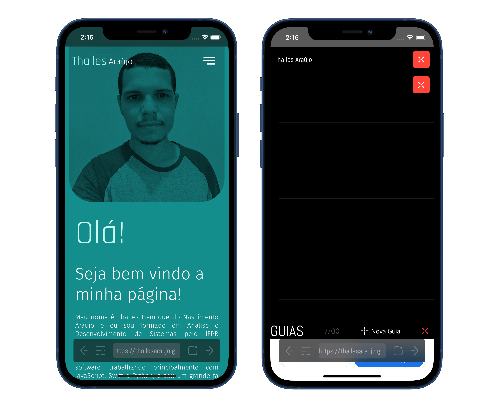

# Sputnik Browser

[deprecated] One-Handed focused browser for iOS (similar to new Safari for iOS 15)

## Motivation

Until iOS 14, Safari and basically any major browser for iOS was tough to use single-handed, specially in taller, "notched" devices. This project aimed to develop an easier browser to use in this specific scenario, with an beautifully crafted user interface.
Since Apple announced the new Safari in WWDC 2021 with improvements to this use case even with functionalities which aren't covered by this project, I decided to declare it discontinued.

## Technical Challenges

- Vibrancy-enabled statusbar (at first, was tried SwiftUI, but after realizing it doesn't suport webviews, the project switched to UIKit. The vibrancy-enabled view from this project is reusable)
- Bottom, floating addressbar (using a top address bar, even with reachability, is simple horrible in iOS. The bottom addressbar was designed to be easily reachable every time the user needs it)
- Tabs functionality (unfortunatelly, I couldn't find a satisfatory way to implement tabs. The current implementation could fail in some specific scenarios an it was the major frustration in this project. I was spending too much time in just this functionality, dalaying all others)

## Usage of this project

You can use any component of this project. If you decide to fork it entirely and continue from where I stoped, please just reference this repository. I'm relatively new in iOS development and it can help me a lot on my professional path.

## Design

- Fonts: [Abel Regular](https://fonts.google.com/specimen/Abel) | [Oxygen](https://fonts.google.com/specimen/Oxygen)
- Iconography entirely designed in [Adobe XD](https://www.adobe.com/br/products/xd.html)